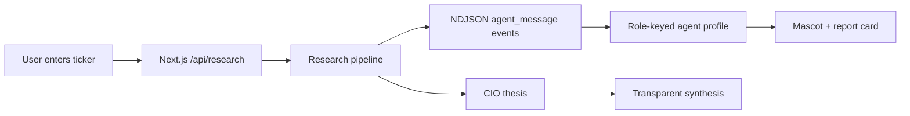
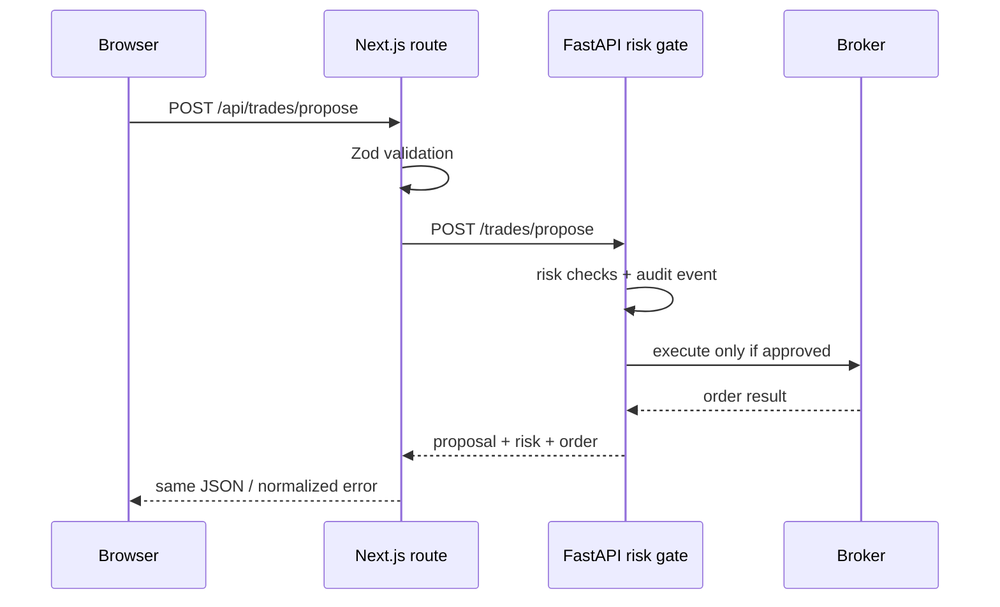

# Agent Mascots, Quant Improvements, and Backend Integration

## 1. Product direction

Every agent should have a stable identity that is tied to its job, not to a random avatar. The mascot is a visual index for the agent’s responsibility: users should be able to recognize whether a statement is evidence collection, market interpretation, bullish advocacy, adversarial review, or final synthesis before reading the full text.

The implementation uses a typed registry in [`src/lib/agents/profiles.ts`](../src/lib/agents/profiles.ts) and a reusable vector component in [`src/components/AgentMascot.tsx`](../src/components/AgentMascot.tsx). The art is inline SVG, so the UI does not depend on an image CDN, external URLs, or per-agent asset loading.

| Agent role | Mascot | Name | User meaning | Accent |
|---|---|---|---|---|
| `news` | Owl | Sage | Catalyst and information quality | Amber |
| `market` | Hawk | Vector | Price action, trend, and regime | Sky |
| `bull` | Bull | Atlas | Strongest evidence-backed upside case | Emerald |
| `bear` | Bear | Mara | Adversarial review and failure modes | Rose |
| `cio` | Compass | North | Portfolio-aware synthesis and uncertainty | Violet |

The profile registry is intentionally separate from the LLM prompts. Prompt identity controls behavior; profile identity controls presentation. This prevents a visual redesign from changing model behavior and allows a future database-backed profile without changing the UI contract.

## 2. User-facing flow

The new `/research` page streams the existing `/api/research` NDJSON pipeline and maps each `agent_message.role` to its profile. An agent card exposes the name, job, stance, confidence, headline, and body. During a run, the same mascot appears in a compact activity timeline so the user can distinguish an agent that is working from one that has already reported.



## 3. Quantitative improvements, in priority order

The existing engine is a useful demo signal, but it should not be presented as production-grade alpha until it has data-quality checks, out-of-sample evaluation, transaction-cost assumptions, and live paper-tracking. The current implementation has five heuristic components and only two registered strategies, while `Quant.md` already lists the broader strategy union and a partially implemented backtest path.

| Priority | Improvement | Why it matters | Acceptance criterion |
|---|---|---|---|
| P0 | Add data-quality and history metadata | Prevent users from treating a short or synthetic series as a reliable signal | Every response includes source, bar count, last bar time, missing/duplicate-bar flags, and `isActionable` |
| P0 | Add a real backtest endpoint with costs | A score without out-of-sample performance is not evidence of edge | Walk-forward results include fees, spread/slippage, turnover, exposure, equity curve, max drawdown, and train/test windows |
| P0 | Make risk sizing explicit | Signal direction is not a position size; the risk service must control notional and loss | Quant emits a suggested risk budget and stop distance, while FastAPI remains the only approval authority |
| P1 | Persist paper-trading outcomes | Repeated backtests can drift and do not prove live usefulness | Each signal stores model version, inputs, timestamp, forecast horizon, and realized forward return |
| P1 | Add correlation and sector-relative features | Concentration can make several individually good signals one portfolio risk | Expose a correlation matrix and sector-relative return/volatility in a risk-consumable route |
| P1 | Complete or narrow strategy coverage | `StrategyId` names more strategies than the registry currently implements | Either implement `TREND`, `NEWS`, and `VALUE`, or remove unsupported IDs and show only registered strategies |
| P2 | Calibrate weights and thresholds | Current component weights and thresholds are hand-set | Walk-forward grid search selects parameters using training data only and reports test-period degradation |
| P2 | Add caching and parallel symbol evaluation | The GET route fetches symbols sequentially and live demos need predictable latency | Fetch benchmark and symbols concurrently, use a short cache, and return per-symbol errors without failing the batch |
| P2 | Add visual diagnostics | Users need to see when a score is fragile | Add close-price sparkline, component contribution, confidence interval, and recent signal history |

Two implementation details deserve immediate correction in the quant workstream. First, the engine labels a metric `sharpe20d` while using a daily-return helper together with a configurable annualization factor; this must be made timeframe-aware or explicitly restricted to daily bars. Second, `Strength = abs(score) * 150` reaches 100 before the score reaches its theoretical maximum, so the UI should distinguish **directional score**, **calibrated confidence**, and **signal strength** instead of presenting the current strength as probability.

## 4. Backend connection contract

The browser should call same-origin Next.js routes, not the FastAPI service directly. The Next.js route keeps the backend URL server-only, validates the payload, applies a timeout, and normalizes the backend error envelope. The implemented bridge is [`src/app/api/trades/propose/route.ts`](../src/app/api/trades/propose/route.ts), configured with `BACKEND_API_URL` in [`.env.example`](../.env.example).



The payload must match the FastAPI `TradeProposal` schema. A quant signal should be translated only when its direction is `BUY` or `SELL`; a `HOLD` signal should never create an order.

```ts
const payload = {
  agent_id: "quant-engine-v1",
  symbol: signal.symbol,
  side: signal.overall.direction === "BUY" ? "buy" : "sell",
  quantity: proposedQuantity,
  order_type: "market",
  strategy: "quant-composite-v1",
  confidence: calibratedConfidence,
  reasoning: buildReasoning(signal),
};

await fetch("/api/trades/propose", {
  method: "POST",
  headers: { "Content-Type": "application/json" },
  body: JSON.stringify(payload),
});
```

The important boundary is that **quant proposes and FastAPI decides**. The frontend must not call a broker endpoint, bypass the risk service, infer approval from a client-side score, or store broker credentials. The backend response should be rendered as a lifecycle state: proposed, approved, adjusted, rejected, submitted, filled, or canceled.

## 5. Recommended next implementation slice

The next quant pull request should add `dataQuality` and `modelVersion` to `QuantSignal`, expose a walk-forward backtest route, and add a paper-outcome table keyed by symbol, strategy, model version, and forecast horizon. The next UI pull request should add a “Propose to risk gate” action only for non-HOLD signals, display the backend’s risk decision verbatim, and subscribe to `/events/ws` for order lifecycle updates.

This sequencing keeps the mascot layer immediately useful to users while preserving a clean separation between explanation, measurement, and execution control.
